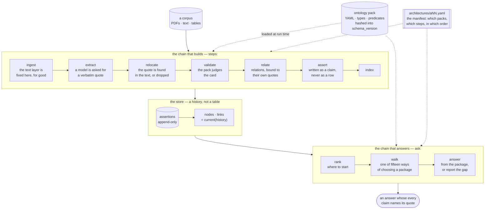
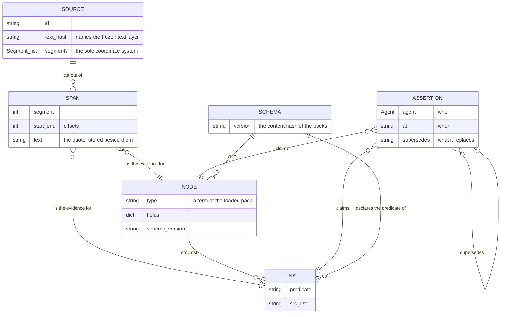
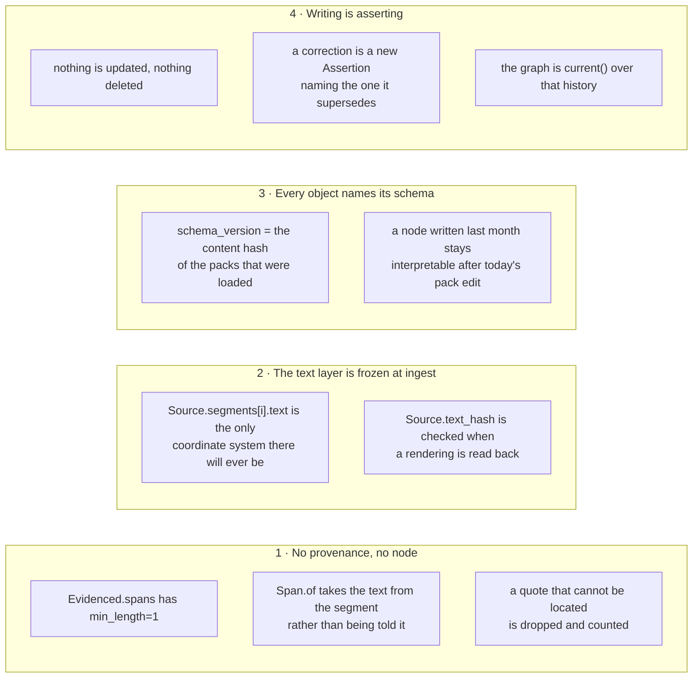
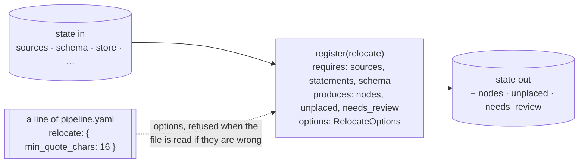
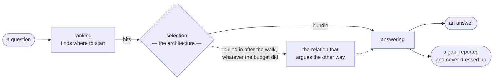

# How Atlas of Science is put together

One page, mostly pictures, for somebody who has just been handed this repository. It says
what the pieces are and how a corpus becomes an answer. Everything here is stated at length
elsewhere: `docs/architecture.md` is the reference, `CLAUDE.md` is the rules,
`docs/architectures/` is one specification per architecture.

---

## 1. The whole thing in one picture



Two things are worth pointing at in that picture, because they are what the library is for.

**The manifest is the only thing that differs between fifteen architectures.** There is no
branch anywhere under `atlas/` on which architecture is in use. By the time anything runs,
there is a pipeline and nothing else.

**The store is a history.** `nodes` and `links` are what `current` projects out of a body of
assertions. Nothing is updated and nothing is deleted, which is what lets a re-extraction
land *under* a human judgement instead of erasing it.

## 2. The six concepts, and nothing of any domain



Not one of those boxes names a type, a field or a predicate of any subject. The types that
used to be built in live in `packs/ml_paper.yaml` now, and it is loaded only when a
configuration names it. `tests/test_substrate.py` is the standing proof: it runs the shipped
steps over an invented vocabulary, and a change under `atlas/` needed to make it pass means a
domain has leaked into the core.

## 3. The four invariants, as the places they are enforced



Break any of these and the markup stops being worth more than the text it came from. They
are the product, not a safety rail around it.

## 4. What a step is, and why that is the whole design

A step is a function from the state of a run plus its configured options to the keys it adds
to that state:



It does not know about a database, a web server or a queue: the store is handed to it.
Storage and IO live at the edge. Adding one is a module under `atlas/steps/`, an import line,
and a test — and a configuration that does not name it does not run it.

That is the whole reason fifteen architectures are maintainable. They are fifteen orderings
of forty-five steps, and the thing that varies between them is a file.

## 5. The rule every architecture obeys



**An answer is built from a walked graph, not a list.** Ranking finds where to start; it does
not find an answer. Every `ask` chain contains a step producing a `Bundle` and ends in one
consuming it; a package that walked nothing is reported as a gap and never handed to a model;
and a relation named under `opposes` is pulled into the package after the walk, whatever the
budget did. `tests/test_catalogue.py` checks all three over every manifest, which is the only
way a rule stated in a document stays true.

## 6. Where to look

| I want to… | Read |
|---|---|
| run it | `README.md` |
| know what must not break | `CLAUDE.md` |
| continue somebody's work | `HANDOFF.md` |
| understand the store, provenance, versioning | `docs/architecture.md` |
| write an ontology pack | `docs/ontology.md` |
| choose between the fifteen | `docs/architectures/README.md` |
| know what is measured, and how | `docs/evaluation.md` |

```bash
atlas variants                       # the fifteen, from the manifests
atlas variants a18 --json            # one of them, as an interface reads it
atlas run architectures/a18.yaml corpus/*.pdf --store store/
atlas ask architectures/a18.yaml "which results hold under both protocols?" --store store/
```
